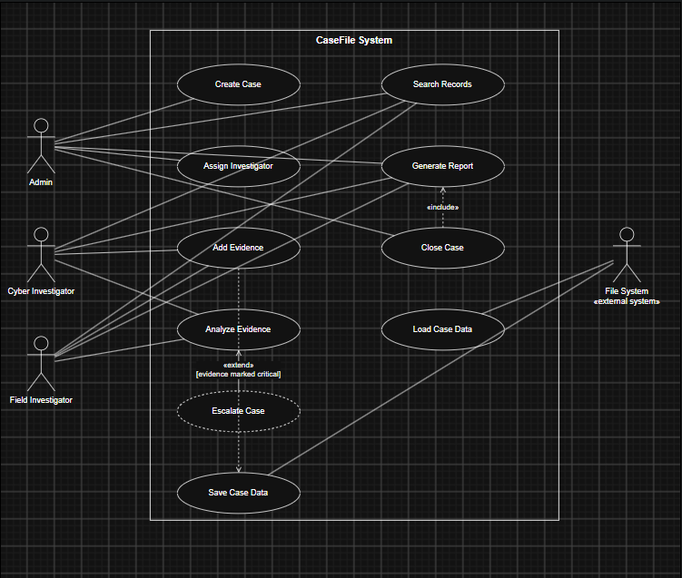

# OOPS-project-Digital-Crime-Investigation-Simulator
# CaseFile — Digital Crime Investigation Simulator

A console-based case management system that models how investigative agencies track suspects, evidence, investigators, and case status — built as an Object-Oriented Programming course project.

## About

Investigations involve multiple interrelated entities — cases, suspects, evidence, and investigators — each with different behavior and strict lifecycle rules (e.g. a closed case can't be modified). CaseFile models this domain using core OOP principles rather than procedural conditionals, so that adding a new evidence type or investigator specialization means adding a class, not rewriting existing logic.

Full problem framing: [`problem-statement.md`](./problem-statement.md)

## Team

| Name | GitHub | Role |
|---|---|---|
|  | `modiumang2007-cmyk` | _e.g. Domain modeling lead_ |
| _Add name_ | | _e.g. Case & exceptions lead_ |
| _Add name_ | | _e.g. Interfaces & reporting lead_ |
| _Add name_ | | _e.g. Persistence & UI lead_ |

## Tech Stack

- **Language:** C++ (C++17), STL only — no external dependencies for core logic
- **Build:** g++ / any standard C++ compiler
- **Diagrams:** PlantUML

## Features (v1 Scope)

- Case lifecycle management (create → assign → investigate → close)
- Polymorphic evidence handling across Digital, Physical, and Testimonial evidence types
- Investigator assignment with specialization-specific investigation behavior
- Keyword search across cases and evidence
- Report generation
- File-based save/load persistence

Out of scope for v1: GUI, database backend, multi-user login.

## Project Structure

```
.
├── README.md
├── problem-statement.md
├── docs/
│   ├── use-case-diagram.puml      # PlantUML source
│   ├── use-case-diagram.png       # rendered diagram
│   └── use-cases.md               # full use case specifications
├── src/
│   ├── Person.h / Person.cpp
│   ├── Evidence.h / Evidence.cpp
│   ├── Case.h / Case.cpp
│   └── main.cpp
└── .gitignore
```

## Use Case Diagram



Source: [`docs/use-case-diagram.puml`](docs/use-case-diagram.puml) · Full specifications: [`docs/use-cases.md`](docs/use-cases.md)

## OOP Concepts Demonstrated

| Concept | Where |
|---|---|
| Abstraction | `Evidence` and `Person` as abstract base classes |
| Inheritance | `DigitalEvidence` / `PhysicalEvidence` / `TestimonialEvidence` extend `Evidence`; `CyberInvestigator` / `FieldInvestigator` extend `Investigator` |
| Polymorphism | `analyzeEvidence()` and `investigate()` resolved via virtual dispatch at runtime |
| Encapsulation | Private fields on `Case` and `Evidence`, accessed through validated getters/setters |
| Interfaces (via multiple inheritance) | `Verifiable`, `Searchable`, `Reportable` — abstract classes with only pure virtual functions |
| Exception handling | Custom exceptions derived from `std::exception`: `DuplicateCaseException`, `InvalidEvidenceException`, `InvalidInvestigatorException`, `CaseClosedException` |
| Collections (STL) | `std::vector`, `std::unordered_map`, `std::unordered_set` |
| File I/O | `<fstream>` for save/load |

## Build & Run

```bash
g++ -std=c++17 -Wall -Wextra src/*.cpp -o casefile
./casefile
```

## Documentation

- [Problem Statement](./problem-statement.md)
- [Use Case Specifications](docs/use-cases.md)
- [Use Case Diagram (PlantUML source)](docs/use-case-diagram.puml)
